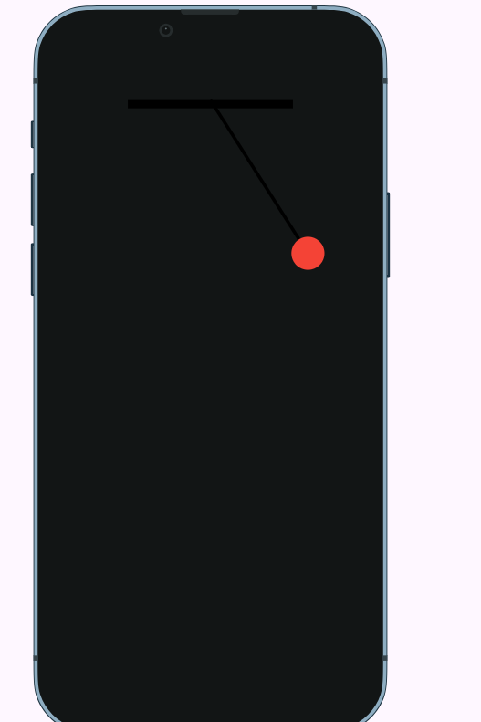
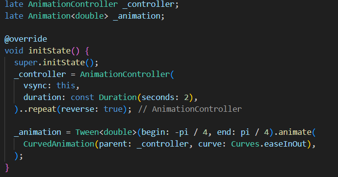
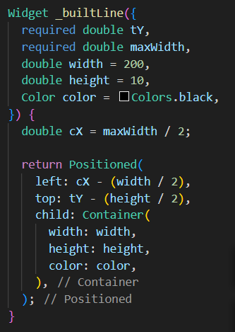
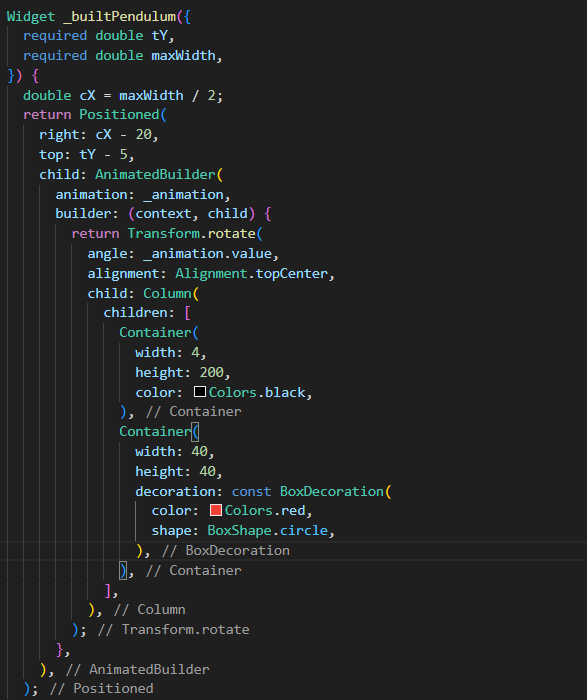

# Hình ảnh kết quả

# Hàm khởi tạo \_controller và \_animation cho con lắc từ -pi/4 tới pi/4

# Widget để built thanh ngang

# Widget để built dây và con lắc

vì em muốn dây và con lắc xoay còn thanh ngang thì cố định nên em tách thành 2 widget và chỉ cho dây và con lắc quay quanh một điểm cố định

